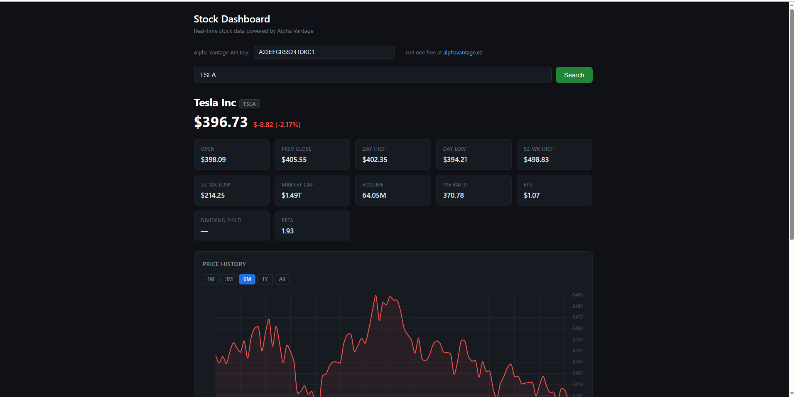
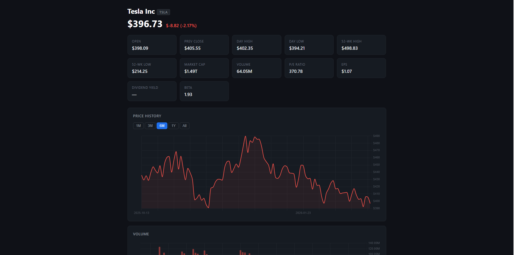
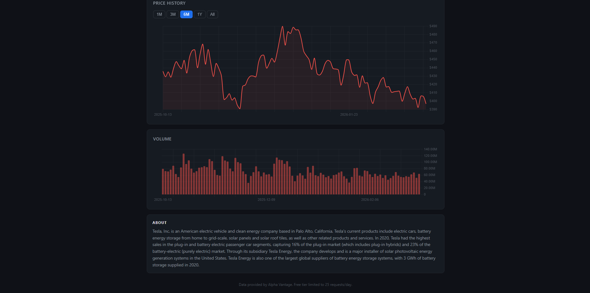

# Stock Dashboard

A single-page stock research tool that pulls real-time quotes, fundamental data, and price history for any US-listed ticker.

## Features

- Current price, day change, and OHLCV stats
- Fundamental metrics: Market Cap, P/E, EPS, Beta, Dividend Yield, 52-week range
- Interactive price history chart (line) with selectable ranges: 1M / 3M / 6M / 1Y / All
- Volume chart (bar) synced to the selected range
- Chart color reflects performance: Green if up, red if down over the chosen period
- Company description from the Alpha Vantage Overview endpoint

## Technologies

| Technology | Purpose |
|---|---|
| HTML / CSS / JS | Single-file app, no build step required |
| [Chart.js 4.4.0](https://www.chartjs.org/) (CDN) | Line and bar charts |
| [Alpha Vantage API](https://www.alphavantage.co/) | Stock quotes, price history, and company overview |

## How to Run

1. **Get a free API key** at [alphavantage.co](https://www.alphavantage.co/support/#api-key) (takes ~30 seconds, no credit card needed).

2. **Open `index.html`** directly in any modern browser, no server or install required.

3. **Enter your API key** in the field at the top of the page.

4. **Type a ticker symbol** (e.g. `AAPL`, `MSFT`, `TSLA`) and press Enter or click Search.

## API Usage

The free Alpha Vantage tier allows **25 requests per day**. Each search makes 3 parallel requests (Quote, Daily Time Series, Overview), so you get roughly 8 lookups per day before hitting the limit.

If you exceed the limit, the dashboard will display a clear error message rather than silently failing.

## Screenshots

